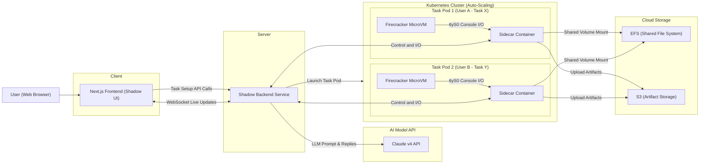

# Shadow System Architecture

**Shadow** is a multi-user, cloud-based AI coding assistant that runs each coding task in an isolated sandbox. The design leverages a Kubernetes cluster to orchestrate **Firecracker microVM** environments for each task, ensuring strong isolation and the ability to scale to many concurrent agents. The system comprises a Next.js frontend, a backend orchestrator, a pool of sandbox pods (each with a microVM + sidecar), and cloud storage for persistence. Below is a high-level overview and detailed breakdown of each component.

## High-Level Architecture Overview

**Figure: System Overview.** The user interacts with the Next.js frontend, which communicates with a backend service. The backend launches isolated task pods on a Kubernetes cluster. Each task pod contains a Firecracker microVM (running the agent and tools) and a sidecar container that bridges communications. The sidecar mounts a shared **EFS** volume for the workspace and streams data to the backend (which in turn updates the frontend via WebSockets). Long-term artifacts and logs are persisted to **S3**. The backend (or agent) uses the **Claude v4** API for AI reasoning.

## Component Breakdown

### 1. Frontend (Next.js Web Application)

The frontend is a Next.js application that serves the user interface for Shadow. Users can log in, select a GitHub repo/branch, choose an AI model (e.g. _Claude v4_), and input instructions to start a coding task. The UI presents a **chat-like view** for each task (at routes like `/task/[taskId]`), showing the conversation between the user and the AI agent, as well as tool usage (file reads, edits, terminal commands, etc.) similar to Cursor or Windsurf interfaces.

- **Task Creation:** The home page includes a form where the user specifies the repository and branch to work on, the model to use, and the task instructions. When submitted, the frontend calls a backend API endpoint to initiate a new task.
- **Real-Time Updates:** Because tasks are long-running, the frontend does not poll for status. Instead, it maintains a **WebSocket** (or similar) connection to receive streaming updates. As the agent progresses (e.g. sending messages, executing commands), those events are pushed to the UI in real time.
- **Task Management:** The UI allows users to view all their active or completed tasks. Each task entry can show its status (running, completed, error, etc.). Users can open a task to see the live console output and conversation.
- **User Inputs:** Users can also send messages or approvals to the agent via the UI. For example, if the agent requests feedback or presents a diff for approval, the user’s response goes through the backend to the agent.

> **Why WebSockets?** Next.js API routes (especially on serverless platforms) are not suitable for long-lived connections or streaming due to execution time limits. A persistent WebSocket (or Server-Sent Events) channel enables the server to push real-time logs and agent messages to the client as the task runs. This way, the Next.js app remains responsive and the user can watch the agent’s progress live.

### 2. Backend Service (Task Orchestrator)

The backend is the brain of the system, responsible for coordinating between the frontend, the AI model, and the Kubernetes cluster. This could be implemented as part of the Next.js server (if running on a custom Node server) or as a separate Node/Python service. Key responsibilities include:

- **Task Initialization:** When a new task request comes in, the backend generates a unique Task ID and uses the Kubernetes API (or a suitable client library) to **spawn a new pod** for the task. It specifies the necessary container images and volume mounts, including the startup command to launch the Firecracker microVM inside the pod. The backend may also attach metadata (labels/annotations with user ID, etc.) for tracking.

- **Managing Agent Sessions:** The backend holds the logic for the AI coding agent's session. It knows which model to use (Claude v4 in this case) and handles the prompt/response cycle if the agent logic is external. There are two possible design approaches for agent execution:

  **(a) External Orchestration:** The backend itself runs the agent loop. In this model, the backend calls the Claude API with the user's instructions and context, receives the AI’s plan or code changes, and then uses the sidecar’s APIs to carry out actions (read/write files, execute commands in the microVM). The backend essentially acts as the "driver," mediating between the AI model and the sandbox environment.

  **(b) In-VM Orchestration:** Alternatively, the agent logic (the sequence of tool-use decisions guided by the LLM) can run _inside_ the microVM. In this case, the microVM would need network access (or proxied access) to call the Claude API. The advantage is that the entire thought process runs in isolation, but it complicates communication (since the UI still needs to get updates). This approach might use the sidecar for proxying model API calls or allow limited egress from the VM.

- **Real-Time Communication:** Regardless of where the agent logic runs, the backend manages a WebSocket server that the frontend connects to for updates. The backend relays messages between the task’s sidecar and the correct user session. For example, when the agent prints something to the terminal or sends a chat message, the sidecar streams that to the backend, and the backend forwards it to the appropriate WebSocket client. Likewise, if the user types a message or a command, the backend forwards it to the sidecar to inject into the microVM’s console or agent.

- **Task Lifecycle:** The backend keeps track of task state. When a task pod starts, it may take a few seconds to pull images and initialize the microVM; the backend monitors this and informs the frontend when the environment is ready. It also handles task termination: if the user cancels a task or when the agent finishes, the backend can delete the pod (or schedule it for deletion after some cooldown period for debugging). Logs and artifacts are gathered (from EFS/S3) for future reference if needed.

- **Multi-User and Auth:** The backend enforces that users can only access their own tasks. It might integrate with an authentication system so that each WebSocket or API call is tied to a user identity. Each task pod could be labeled with the user’s ID, and the backend will only stream data to the user who owns that task. This ensures isolation not just at the infrastructure level but also at the application level.

### 3. Kubernetes Cluster and Auto-Scaling

The system runs on a Kubernetes cluster which provides elasticity and isolation for running multiple tasks concurrently. Each **task** corresponds to **one pod** in the cluster (one pod per running agent).

- **Pod per Task:** By giving each task its own pod, we ensure strong isolation between tasks (especially since each pod will contain a microVM, adding another isolation layer). Different users’ tasks run in separate pods, and even a single user’s multiple tasks are isolated from each other. No data is shared unless persisted to a common store. Kubernetes will also restart a pod if it fails, ensuring a task can recover or at least fail cleanly without affecting others.
- **Resources:** Each pod can be given a certain CPU and memory limit. Firecracker microVMs are lightweight, with a memory overhead of <5 MiB per VM, so the main resource considerations are the memory/CPU needed for the code execution and any heavy processes in the task (like compilers, tests) and the AI model's context. In the Claude model scenario, the heavy computation is handled by the Claude API (outside our cluster), so the microVM itself might not need a huge amount of CPU—just enough to run editors, compilers, or test suites as needed.
- **Node Auto-Scaling:** The cluster can scale the number of nodes (VM instances) based on load. When many tasks are launched concurrently, new Kubernetes nodes will spin up to accommodate more pods. Each node can host multiple task pods, up to the capacity of its CPU/RAM. Firecracker is designed to run many microVMs per host efficiently, so a powerful node might run dozens of small tasks. Conversely, when tasks complete and pods terminate, the cluster can scale down to free up cost.
- **Ease of Deployment:** Using Kubernetes provides a convenient way to manage the containerized sidecars and to schedule Firecracker VMs. However, setting up Firecracker inside Kubernetes may require using privileged containers or special runtimes (since Firecracker needs KVM access). One implementation option is **Firecracker-Containerd** or **Kata Containers**, which integrate with Kubernetes to run pods as microVMs. _For an easier approach_, if the complexity of Firecracker is too high initially, one could run tasks as regular Docker containers in pods (with less isolation) and later transition to microVMs. Another alternative is using a managed service (like AWS Fargate, which internally uses Firecracker) to run each task in isolation without managing the microVM details, though this could limit flexibility.

### 4. Task Pod Structure: Firecracker MicroVM + Sidecar

Each task pod uses a **sidecar container pattern** to interface with the isolated microVM. The pod will typically consist of two containers:

- **Main Container (MicroVM Runner):** This container launches the Firecracker **microVM** process (using the Firecracker API or a wrapper script). The microVM boots a lightweight guest OS (e.g., an Alpine or Ubuntu image) which contains the development tools, the user’s code, and possibly an agent runtime. The microVM provides a _virtual hardware environment_ (CPU, memory, minimal devices) that is heavily sandboxed from the host. Firecracker’s companion **jailer** process is used to lock down the microVM’s permissions — for example, by chrooting into a dedicated folder and dropping privileges, so the microVM cannot see the host file system at all. This ensures that even if the code running inside the VM is malicious or crashes, it cannot escape or affect other tasks.

- **Sidecar Container:** The sidecar is a regular Kubernetes container that runs alongside the microVM process in the same pod. Its job is to **bridge communication** between the isolated VM and the outside world. Because the microVM is jailed and cannot directly access the host or network easily, the sidecar provides controlled channels for I/O:

  - _File System Bridge:_ The sidecar mounts a shared **EFS volume** (Network File System) at a known mount point (say `/workspace`) and also makes that available to the microVM (more on this in the Storage section). This allows the sidecar to see any files the microVM creates or modifies, and vice versa, enabling file synchronization without breaking isolation.
  - _Terminal and I/O:_ The sidecar attaches to Firecracker’s **serial console** (ttyS0). Firecracker outputs all guest console logs to its stdout, which the sidecar can capture. The sidecar also can send input to the guest by writing to the serial interface. In practice, this means the sidecar can **feed commands** into the microVM’s terminal and **read output** from it. This mechanism is used to implement the live terminal feature.
  - _Networking (Optional):_ If the microVM needs network access (for example, to reach the Claude API or to install packages), the sidecar might set up a network interface (e.g., using a TAP device and NAT). Alternatively, the sidecar can proxy specific requests. (If internet access is disabled for security, the microVM could still perform offline tasks on the codebase, and only the sidecar/backend handle external calls.)
  - _API Endpoints:_ The sidecar exposes an internal API (or RPC interface) that the backend uses to control the task. For instance, the backend can instruct the sidecar to open a file or execute a shell command in the VM. The sidecar translates those requests into actions on the VM (either via the shared filesystem or the console). It can also expose **WebSocket** endpoints to stream the terminal output in real-time to the backend.

**Why a Sidecar?** Firecracker’s isolation (with the jailer) is so effective that the host (and by extension the backend) cannot directly reach into the VM’s file system or processes. The sidecar is a trusted helper that lives in the same pod (so it can have shared memory or mounts) and mediates all interactions. This design preserves security while still allowing the needed functionality for a remote coding environment.

### 5. Terminal Streaming and In-Memory Buffers

One of Shadow’s core features is a live terminal for each task, allowing users to see output (and potentially type input) as if they were at a console. Implementing this requires connecting to the microVM’s console and relaying data efficiently:

- **Firecracker Serial Console:** Firecracker provides a serial console device (emulating a 8250 UART) that outputs the guest’s console text. We configure each microVM to output its console to `ttyS0` and disable any graphical terminal, so all logs and shell output go to this serial port. The Firecracker process streams this to its standard output, which our sidecar can read. We pass kernel boot parameters like `console=ttyS0` to ensure the guest OS sends its output there.
- **Sidecar Ring Buffers:** The sidecar maintains **in-memory circular buffers** to hold the terminal I/O history. For example, it might keep the last 1000 lines of output and the last 100 commands of input in memory. This serves two purposes: (1) it allows new WebSocket clients (like when you reconnect or open the task page) to immediately get recent output history without storing logs on disk, and (2) it provides backpressure protection – if the output is very large or bursts quickly, the buffer can overflow old data rather than grow unbounded, preventing memory bloat.
- **WebSocket Streaming:** The sidecar streams the console output to the backend (and then to the frontend) over a WebSocket in real-time. Every time a new line appears on the VM’s console, the sidecar appends it to the buffer and pushes it out to any connected clients. This happens with sub-second latency (the overhead is minimal since we avoid writing to disk). Likewise, if the user types into a terminal UI, that input is sent via WebSocket to the sidecar, which writes it into the VM’s console input stream. This bi-directional flow effectively links the user’s browser to a shell inside the microVM.
- **Connection Management:** The in-memory buffer allows the system to handle disconnections gracefully. If a user briefly loses connection or closes their laptop, the sidecar retains the recent output. When the user reconnects, the backend can request the sidecar to send the buffered history so the user sees the last N lines of context. Then live streaming resumes. This way, even long-running tasks can be followed without losing information.
- **Security & Limits:** Since the user’s code running in the VM could potentially spew infinite output (for example, a `tail -f` on a growing log), the sidecar enforces limits: the buffers have maximum sizes, and the sidecar can throttle the rate of messages sent over the network. Each task’s terminal is isolated to its microVM, so data never crosses over to the wrong user. No terminal data is persisted to disk by default (unless we choose to save a log to S3 at the end), which reduces risk of leaking sensitive info to storage.

In summary, this design provides a **real-time terminal** experience with **no filesystem I/O overhead** during operation, as recommended by Firecracker’s documentation on using fixed-size buffers for console output. It strikes a balance between performance and safety for interactive sessions.

### 6. Storage: EFS for Workspace, S3 for Artifacts

We use a combination of Amazon EFS and S3 to handle storage needs, leveraging each for its strengths:

- **EFS (Elastic File System):** EFS is a managed NFS that can be mounted across multiple instances/pods. In our design, the EFS volume is mounted on the **sidecar container** (and potentially on the host or backend server as well) at a path like `/mnt/workspaces/<taskId>`. This same mount is shared with the microVM as its **project workspace**. For example, the microVM guest OS might mount an NFS share (pointing to the EFS) at `/workspace`. All code files, editor changes, compilations outputs, etc., will be stored on this shared volume. This setup has several advantages:

  - The backend (outside the pod) can read/write the workspace files in real time if needed, since it can also mount or access the same EFS path. This is useful for features like showing diffs in the UI, indexing the code for search, or simply letting the user download files from the UI. It also means if the agent requests a file from the repository, the backend could directly read it from EFS instead of going through the VM.
  - Multiple pods (if needed) could access common data. For instance, if we cache a copy of popular git repositories or large language model indexes on EFS, new tasks can mount that and avoid re-downloading everything. The research notes suggest using EFS for **shared build caches** and dependencies across tasks.
  - EFS provides persistence during the task’s life: if the microVM reboots or the sidecar restarts, the data isn't lost since it's on network storage. (However, we might treat each task as ephemeral and still copy data out at the end.)
  - Terminal session logs or history could also be written to a file on EFS by the sidecar if we wanted to persist them beyond the in-memory buffer (optional).

- **MicroVM Root Filesystem:** It’s important to note that the microVM’s **root filesystem** is separate from the workspace. Each microVM boots from a disk image (a file) that contains the OS and base tools. This image could be stored on an S3 bucket or baked into the container image that runs Firecracker. The Firecracker API will attach it as a read-write block device for the VM. We might use a lightweight Linux distro with pre-installed compilers, debuggers, and the agent code. The workspace (EFS) might be attached as a secondary disk or via an NFS mount inside the VM. The Firecracker testing framework demonstrates how each microVM can be configured with a rootfs file for the OS.

- **S3 (Simple Storage Service):** S3 is used for **long-term storage and artifacts**. While a task is running, we prefer the low-latency, POSIX compliance of EFS. But once a task completes, we don’t want stale data lingering in our EFS (which might be limited in size or costlier for large volumes). The sidecar or backend will upload important results to S3 at task completion. This could include:

  - Final artifacts like built binaries, zip files, or reports generated by the code.
  - Logs of the session (conversation, actions, and console output) for auditing or debugging.
  - The diff or full state of the repository if the user wants to review the changes later or download them.
  - Any cache or dependency that is worth preserving (though usually caches might be better kept on EFS for reuse rather than per-task in S3).

  S3 is also useful for **caching source repositories**. For example, if user tasks often clone the same GitHub repo, the backend could maintain a cached copy on S3 so new tasks can fetch it faster (possibly the sidecar could check S3 and populate EFS at task start to avoid hitting GitHub rate limits or taking too long on clone).

- **File Flow Summary:** When a task starts, the backend (or sidecar) will **clone the Git repo** into the EFS-mounted workspace. The microVM boots up and has that workspace available (either through an NFS mount or a virtio-9p mount, etc.). The agent inside the microVM operates on those files (reads, writes code, runs tests). All changes are instantly on EFS, so the sidecar or backend can also see them. When the task is done, we bundle up results to S3 for long-term storage or user download, then optionally wipe the EFS workspace for that task (to save space). We might keep it around for a short "cooldown" period in case the user wants to inspect the environment, but eventually it gets cleared.

> **Security Consideration:** Because EFS is shared infrastructure, we mount each task’s directory separately and enforce that tasks only access their own subdirectory. The sidecar can run with restricted permissions such that it only sees `/mnt/workspaces/<taskId>`. The microVM’s NFS client should also be restricted to that subpath if possible. This ensures one task cannot tamper with another’s files. The Firecracker jailer already restricts the microVM’s view of the filesystem, so as long as the NFS mount is properly confined, the VM can’t see anything else.

### 7. AI Model Integration (Claude v4)

Shadow’s coding intelligence is provided by an AI model, assumed here to be **Anthropic Claude v4** (referred to as "Claude sonnet 4"). This is a large language model similar to OpenAI’s Codex/GPT, capable of understanding instructions and generating code or text.

- **Model API:** We integrate with Claude via its API. The backend holds the API keys and makes HTTP requests with prompts and context. Typically, when a task starts, the agent will send an initial prompt to Claude that includes the user’s instructions and some relevant context (e.g., a summary of the repository or the file where changes are needed). Claude then returns a response which could be a plan or direct code changes. The backend (or in-VM agent) parses this and decides on actions.
- **Agent Loop:** Usually, these coding agents operate in a loop of _Think → Act → Observe → ..._. For example, the agent might ask Claude: _“How should I implement feature X in this codebase? Provide step-by-step.”_ Claude might reply with a plan: _“1. Open file A.py and add function foo. 2. Update B.py to call foo. 3. Run tests.”_ The agent then executes these steps one by one: editing files (via the sidecar’s file API or by echoing text into the VM’s editor), then perhaps instructing the VM to run tests (`npm test` or similar). The output of those commands (e.g., test failures) is captured and sent as the next prompt to Claude to decide how to fix errors, and so on.
- **Auto vs Manual:** Shadow is designed to allow both fully autonomous runs and user-in-the-loop operation. In autonomous mode, the agent will keep iterating with Claude’s guidance until it decides the task is complete (or a limit is reached). In manual mode, it might pause and ask for user approval, for example showing a diff and asking “Accept changes? (yes/no)”. The backend facilitates this by either halting the loop and waiting for user input (which comes via the frontend UI and is then sent to the agent/Claude) or by switching to a conversation mode where the user can ask for explanations.
- **Multiple Models Support:** While we assume Claude v4 here, the system is designed to be model-agnostic. The backend could route requests to different model APIs (OpenAI GPT-4, Google PaLM, etc.) based on user selection. This mostly affects only the prompting logic and API call part; the rest of the system (environment, file handling) remains the same. To support this, the agent could be abstracted behind an interface so that it doesn’t matter which LLM is answering, as long as it can follow the tool-use format (i.e., respond with actions or code when needed).
- **Cost Considerations:** Using a powerful model like Claude v4 will dominate the cost per task. Since the user isn’t very concerned with cost for this design, we focus on best practices: for instance, reusing context efficiently (don’t send the entire codebase in every prompt, instead use a relevant subset), and possibly using a smaller model for simple tasks and a bigger one only when needed. We also ensure that secrets (like the API keys for the model) are kept out of the microVM and secure (in Kubernetes, the API key can be in a Secret and provided only to the backend service or sidecar that needs to call the model).

### 8. Multi-User, Multi-Task Isolation and Security

The architecture supports multiple users simultaneously, each possibly running multiple tasks. Key design points to handle this include:

- **Isolated Environments:** As described, each task runs in its own microVM inside its own pod. This provides a strong security boundary – tasks cannot interfere with each other’s file system or processes. The Firecracker microVM acts as a virtual air-gap. Even if two tasks run on the same Kubernetes node, their microVMs are isolated by hardware virtualization and the jailer (which uses Linux primitives like cgroups, namespaces, and chroot to lock each VM down). For an extra layer, Kubernetes can be configured to schedule different users' pods on different nodes or apply pod security policies.
- **Authentication and Authorization:** The backend service is aware of user identities (likely through a JWT or session token provided by the Next.js app). When a user initiates a task, the backend tags that task with the user’s ID. The WebSocket channels are also authenticated. The sidecar’s APIs might require a token to ensure only the backend (and thus only the rightful user via the backend) can invoke actions. This prevents any chance of one user sniffing or hijacking another user's task stream.
- **Resource Quotas:** To prevent abuse or runaway costs, the system can impose limits per user (e.g., max N concurrent tasks, max CPU/RAM per task). Kubernetes makes it easy to quota namespaces or use a fairness policy in the scheduler. Each user could be given a namespace or a label that the scheduler uses to distribute resources.
- **Scaling Strategy:** The cluster’s auto-scaler will add capacity when many tasks are running. We configure it with a target CPU utilization, etc., to decide when to spin up new nodes. In practice, because Firecracker can pack microVMs densely, we might opt for a smaller number of larger nodes rather than many tiny nodes (to reduce overhead and cost). The design can leverage the high density potential: Firecracker VMs have very low memory overhead per VM, so dozens of tasks can live on one machine if they are not too busy. However, for heavy workloads (e.g., running large test suites), tasks might consume more CPU and memory, so the system scales out accordingly.
- **Cleaning Up:** Each task pod is destroyed when the task is over, freeing resources. Any leftover data in its EFS subdirectory can be cleaned or archived. We ensure that no sensitive data is left on the node’s local disk; using EFS means most data is on the network file system. The microVM’s rootfs is typically read-only or fresh for each task, so there’s no cross-contamination. The ephemeral nature of pods and VMs contributes to security and freshness of each session.

### 9. Detailed Task Execution Flow

To tie everything together, here’s how a typical task might execute step by step:

1. **User Starts a Task:** The user fills the form (repo + instructions) on the frontend and submits. The browser sends a request to `POST /api/tasks` on the Next.js backend.
2. **Pod Launch:** The backend service receives the request, records a new task entry in a database (for tracking), and calls the Kubernetes API to create a new pod for this task. The pod definition includes:

   - The main container with the Firecracker binary (and the prepared VM image ready to boot).
   - The sidecar container with the bridging software.
   - A volume mount for EFS (e.g., mounted into the sidecar at `/mnt/workspace` and made available to the microVM).
   - Environment variables or config: e.g., task ID, perhaps an API endpoint for the sidecar to call back to, etc.

3. **Environment Setup:** The pod starts up on some node. The sidecar container initializes first: it might prepare the workspace by mounting EFS and cloning the GitHub repo into the `/mnt/workspace` folder. (Alternatively, the cloning can be done by the agent inside the VM, but doing it in the sidecar before boot can save time and allow reusing cached creds or repos.)
4. **MicroVM Boot:** The main container launches Firecracker, pointing it to the kernel and root filesystem image, and configures a tap device or vsock for communication. The microVM boots the guest OS (likely very quickly, in a few hundred milliseconds). The guest OS fstab or init scripts mount the EFS share (via NFS) to `/workspace` so that the code is accessible inside the VM.
5. **Agent Startup:** Inside the microVM, we automatically start the agent controller process (this could be a Python script or Node app that is the “brain”). It connects to the Claude API and perhaps also opens a connection to the sidecar (depending on design) or simply writes to stdout for any logging/communication.
6. **Handshake:** The sidecar detects that the VM is up (for instance, reading a special message on the console or waiting a few seconds). It then establishes a WebSocket connection to the backend to announce “Task ready” and begins forwarding the VM’s console output. The backend in turn notifies the frontend that the task has started and the terminal stream is available.
7. **Task Execution:** Now the agent (Claude-driven) is performing the coding task:

   - It may output a message like “Cloning repository and analyzing code...” which, if printed to stdout, gets relayed to the user via the sidecar and backend WebSocket.
   - It reads files from `/workspace` (the repo) to understand the context. If a code indexing service is available, the backend might have pre-computed some vectors or summaries for the repo which it provides to the agent.
   - The agent sends a prompt to Claude through the AnthropIC API (this call could be made by the backend or by the agent in-VM). Claude responds with instructions or code.
   - The agent then performs actions: e.g., **edit a file** – it can open the file path (since `/workspace` is accessible) and apply a patch. If running externally, the backend can call a sidecar API like `PATCH /file?path=/workspace/foo.py` with diff content; if running internally, the agent just modifies the file and saves.
   - The agent might then **run tests** – it sends a command to the terminal like `pytest` or `npm test`. The sidecar receives this command (from backend or directly from agent’s stdout if agent writes `RUN: pytest` for example) and injects it into the VM’s console input. The command executes inside the VM; all output (e.g., test results) are captured by sidecar and streamed out. The agent sees the output (if external, the backend sees it and includes in next prompt; if internal, the agent process in VM sees stdout).
   - This loop continues: the agent formulates new Claude queries including the latest output or errors, Claude suggests fixes, agent applies them, and so on.
   - Throughout this process, every significant event can be logged as a **message in the chat** visible to the user (e.g., “📂 Read file `foo.py`”, “✏️ Updated `bar.py`”, “🚀 Ran tests, 2 failed”). These could be printed by the agent or generated by the backend by intercepting actions. The frontend shows them to keep the user informed.

8. **User Interaction:** If at some point the agent asks the user a question (say it’s unsure about a requirement or needs confirmation to proceed with a potentially destructive change), the system will wait. The question appears in the UI via the streamed messages. The user can then type a reply. That reply goes to the backend, which forwards it to either the agent (in-VM) or directly into the next Claude prompt. The agent then continues based on the user’s input.
9. **Completion:** When the agent declares the task done (or the user stops it), the backend will begin termination:

   - It instructs the agent (if external) to end the loop. If internal, the agent process exits.
   - The sidecar might wait for a signal that no more output is coming, then finalize any pending file writes.
   - The sidecar/backend uploads the final results to S3: e.g., the final patch or entire updated repository, plus logs of the session if needed.
   - The backend updates the task status in the database to "completed" (and maybe stores pointers to the S3 artifacts).
   - The frontend is notified (via WebSocket or a final message) that the task is complete. The user can review outputs or download artifacts/patches from a link (served from S3).

10. **Cleanup:** After a grace period, the Kubernetes pod is destroyed (if not immediately). This frees up the resources. The EFS workspace might be cleared or archived. If another task was waiting for resources, they can now proceed as the cluster scaled down or re-allocates freed capacity.

### 10. Options and Alternatives

The above design is comprehensive and leverages cutting-edge isolation (microVMs) and cloud infrastructure. However, there are alternative approaches and simplifications that could be considered, especially if ease-of-implementation is a priority:

- **Using Containers Instead of MicroVMs:** If managing Firecracker and its jailer is too complex, an easier (but less secure) route is to use plain Docker containers for tasks. Each task pod could just run a Docker container with the code and agent. This simplifies file sharing (you could mount volumes directly) and networking (container can directly call APIs). Tools like Docker sandboxing or gVisor could add some extra isolation. The trade-off is a larger attack surface compared to Firecracker’s minimal VM approach.
- **Managed Sandbox Services:** AWS Fargate or Google Cloud Run could run tasks without managing servers. Fargate, for example, internally uses Firecracker to isolate tasks. You could have the backend launch a Fargate task for each request. This offloads the orchestration to AWS. The downside is less control (for example, integrating the real-time terminal might be trickier without a sidecar under your control).
- **Dedicated Long-lived Agents:** Instead of spinning up a new pod per task, you could keep a pool of warm sandboxes ready to go (to reduce startup latency). A service like **Weave Ignite** (which manages Firecracker VMs with a container UX) could maintain VMs that are reused for tasks. However, reusing environments has caching benefits but risks leftover state; starting fresh per task is cleaner and more secure.
- **Simpler Storage Options:** If EFS is not available or too slow, one could use node-local storage or an emptyDir volume for the workspace and then upload to S3. This would eliminate network filesystem overhead. The challenge is the backend wouldn’t be able to read files in real time unless the sidecar provides an API to fetch them. EFS offers convenience at the cost of some performance and expense. In a smaller setup, using a shared NFS server or even volumes attached to each pod might suffice.
- **Scalability vs Cost:** The design assumes scaling to multiple nodes. If you anticipate only a few concurrent users, it might be viable to run everything on a single beefy machine (no Kubernetes at all) – just spawn Firecracker VMs via a simple script or use Docker+KVM. Kubernetes adds complexity but pays off when you need to dynamically handle many tasks and ensure high availability. Given that cost is not the primary concern, the Kubernetes route with auto-scaling is a robust choice.

---

By following this system design, **Shadow** will provide a flexible, secure, and real-time collaborative coding agent environment. Each user gets isolated compute for their AI agent, complete with a full filesystem and terminal, while the system seamlessly manages communication and scales in the background. This architecture balances **security** (through Firecracker microVM isolation), **performance** (real-time streaming via in-memory buffers, minimal overhead per task), and **user experience** (live chat interface with an AI pair programmer). With this foundation, Shadow can be extended with features like sub-agents, parallel task orchestration, and deeper IDE integration, confident that the underlying infrastructure can support advanced use cases.
